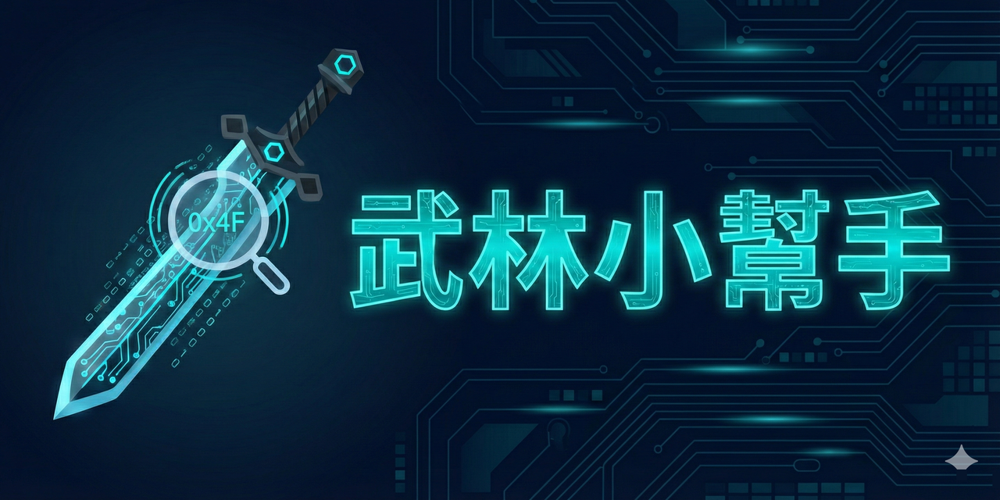

# 武林小幫手

Tthol 遊戲的即時資訊讀取工具，唯讀不修改遊戲。

武林小幫手透過讀取遊戲程式的執行記憶體來取得角色資訊，就像在旁邊偷看遊戲的「工作草稿」一樣。工具只會讀取，不會寫入或修改任何數值，對遊戲運行沒有影響。因為存取其他程式的記憶體需要系統權限，所以執行時會要求管理員身分。

## ✨ 功能

**背包讀取**
顯示所有道具名稱與數量，一目了然。

**角色面板**
即時顯示血量、真氣、等級、座標等角色資訊。

**快照比較**
記錄某個時間點的狀態，稍後可對比差異。

## 📥 安裝

1. 從 [Releases](../../releases) 下載最新版 zip
2. 解壓縮到任意資料夾
3. 右鍵 `start.bat` → 以系統管理員身分執行

每次啟動會自動更新到最新版。

## ❓ 常見問題

**防毒軟體誤報**
本工具需讀取遊戲 process 記憶體，部分防毒會誤判。
可將資料夾加入白名單，或至 GitHub 查看原始碼確認安全性。

**更新失敗**
請確認電腦能連上 GitHub (github.com)。
